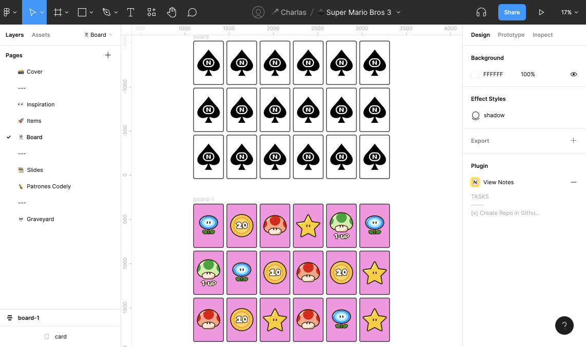
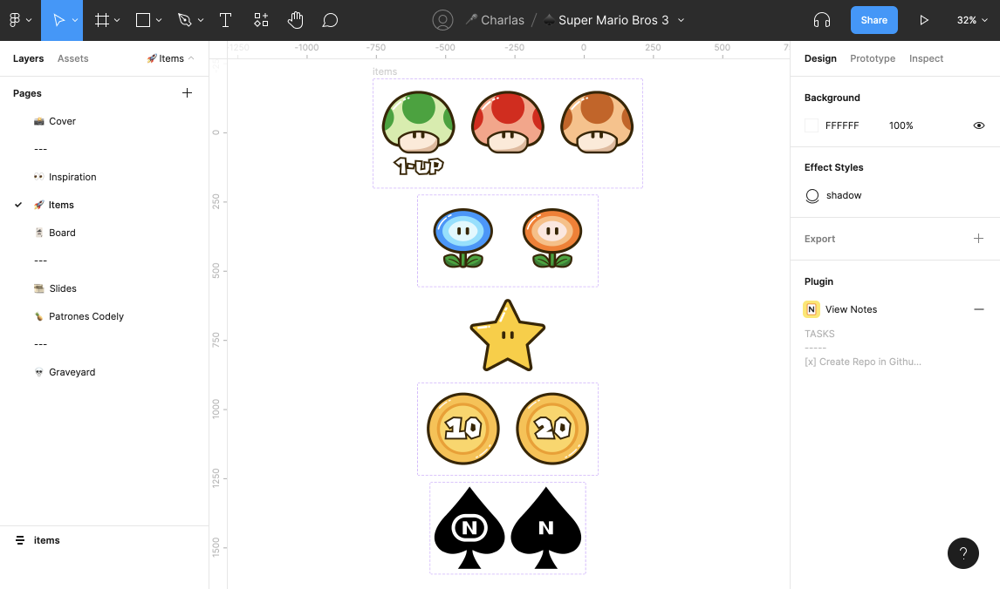

## 💃 AdaLoversConf22
### 🎁 Repositorio del Workshop "Desarrolla tu primer videojuego"

En este tutorial veremos conceptos básico de HTML, CSS y JS. Tocaremos transiciones, data-attributes, flexbox... no hace falta ser una experta para seguir este tutorial, si sabéis que estos lenguajes web existen, es todo lo que se necesita 🤘

### 👏 Diseño y Desarrollo

La interfaz del juego se ha diseñado en `Figma` 
//TODO añadir la URL del archivo subido a `Figma Community`





### 🏗 Arquitectura de archivos

Estos son los archivos necesarios para nuestro proyecto:

1. Creamos la carpeta de `memory-game`
2. Entramos en la carpeta creada
3. Dentro generamos los archivos `index.html` `styles.css` `scripts.js`
4. Creamos la carpeta `assets` 

En la consola:
- 1️⃣  mkdir memory-game
- 2️⃣  cd memory-game
- 3️⃣  touch index.html styles.css scripts.js
- 4️⃣  mkdir assets

### 🍱 Cositas en nuestro HTML
En el archivo `index.html` tenemos que linkar los dos archivos que hemos creado, el `styles.css` y el `scripts.js`.

```
<!-- index.html -->
<!DOCTYPE html>
<html lang="es">
<head>
  <meta charset="UTF-8">

  <title>Super Mario Bros 3 - Juego de memoria</title>

  <link rel="stylesheet" href="./styles.css">
</head>
<body>
  <script src="./scripts.js"></script>
</body>
</html>
```

### 🃏 Nuestro jueguico de cartas
El juego tiene 18 cartas, cada una está creada por un `div` contenedor que hemos llamado `.memory-card`, el cuál tiene dos imágenes `SVG`. La primera imágen será la cara frontal `front-card` y la segunda será común a todas, con el logo original de Nintendo cómo `back-card`.

```
<div class="memory-card">
  
  
</div>
```
### 🍱 Layout principal


```
<section class="memory-game"></section>
```

### 🍍 Dando estilo a nuestro jueguico

Utilizaremos un reset muy básico pero efectivo 👇

```
/* reset.css */

* {
  padding: 0;
  margin: 0;
  box-sizing: border-box;
}
```

ℹ️ Un poco de teoría:

- El modelo de caja 'box-sizing': La propiedad `border-box` incluye los padding y valores de borders dentro del tamaño total del elemento, width y height. Así simplificamos los cálculos.

- Indicando al body que tenga un `display: flex` a la clase .memory-game que actua como contenedor, creamos una alineación vertical y horizontal.

- La clase `.memory-game` también será un contenedor con comportamiento `flex-container`. Por defecto, los elementos vienen seteados con `shrink` en lo ancho para ajustarse al contenedor. Seteando `flex-wrap` con el valor `wrap`, los `flex-items` se wrapearan a lo largo de multiples lineas dependiendo de su propio tamaño.

```
/* styles.css */

body {
  height: 100vh;
  display: flex;
  background: #060AB2;
}

.memory-game {
  width: 640px;
  height: 640px;
  margin: auto;
  display: flex;
  flex-wrap: wrap;
}
```
### 🍍 Dando estilo a nuestro jueguico
La altura y el ancho de cada carta está calculado con la función `calc()` de `CSS`, hemos creado `3 filas`, con `6 cartas` en cada fila con un `16.6%` y una altura de `33.3%` y restamos 10px para añadir el margen entre cartas.

Para poder posicionar los "hijos" del contenedor `.memory-card`, hemos añadido la propiedad `position: relative`, para poder posicionar los hijos de manera absoluta `position: absolute` relativa al contenedor 'madre'.

La propiedad `position: absolute` está indicada a ambas caras de las cartas `.front-card` y `.back-card` esto hará que los elementos salgan de su flujo normal y se posicionen una cara sobre otra.

```
/* styles.css */

.memory-card {
  width: calc(16.666% - 10px);
  height: calc(33.333% - 10px);
  margin: 5px;
  position: relative;
  transform: scale(1);
  transform-style: preserve-3d;
  transition: transform .5s;
}

.front-face,
.back-face {
  width: 100%;
  height: 100%;
  padding: 20px;
  position: absolute;
  border-radius: 10px;
  border: 3px solid var(--border);
}
```

//TODO añadir pantallazo de este estado

### 🍿 Animando el cotarro
Vamos a añadir una micro interacción que simulará un `efecto click`. La pseudo clase `:active` actuará de trigger cada vez que el elemento sea clicado y aplicará una animación al tamaño de la carta con `.2s transition`.


```
.memory-card {
  width: calc(25% - 10px);
  height: calc(33.333% - 10px);
  margin: 5px;
  position: relative;
  transform-style: preserve-3d;
  box-shadow: 1px 1px 0 rgba(0, 0, 0, .3);
  transform: scale(1);
}

 .memory-card:active {
   transform: scale(0.97);
   transition: transform .2s;
 }
 ```

### 👋 Añadir cursor custom
Hemos añadido la manita de Mario como cursor para simular que es él quién está seleccionando las cartas.

Podemos crear un cursor custom con la siguiente linea de código:

```
/* styles.css */

body {
  height: 100vh;
  display: flex;
  cursor: url('./assets/cursor.cur'), auto;
}

```

### 🩴 Flip card
//TODO estudiar bien esta parte
Para crear el efecto de voltear la carta cada vez que sea clicada, vamos a añadir la clase `.flip`. Con un `document.querySelectorAll` seleccionamos todos los elementos del contenedor `memory-card` con `document.querySelectorAll`, se genera un loop con cada `forEach` y le atacha un `event listener`. 

Cada vez que una carta sea clicada la `función flipCard` será ejecutada.
La variable `this` representa que la carta ha sido clicada. 

La `function` accede a los elementos de `classList` y hace un `toggles` a la `flip class`:

```
// scripts.js
const cards = document.querySelectorAll('.memory-card');

function flipCard() {
  this.classList.toggle('flip');
}

cards.forEach(card => card.addEventListener('click', flipCard));
```

La clase `.flip` rota la carta `180deg`:

```
.memory-card.flip {
  transform: rotateY(180deg);
}
```

Para producir el `efecto 3D`, añadimos una propiedad de perspectiva a la clase `.memory-game`. Esta propiedad define cuanto de lejos en el plano de `a` el objeto se alejará de nuestra vista.


Para un efecto `subtle` aplicamos a la perspectiva un valor de `1000px`:

```
/* styles.css */

.memory-game {
  width: 640px;
  height: 640px;
  margin: auto;
  display: flex;
  flex-wrap: wrap;
  perspective: 1000px;
}
```
To the `.memory-card` elements let’s add `transform-style: preserve-3d`, to position them in the 3D space created in the parent, instead of flattening it to the `z = 0` plane (`transform-style`).

```
/* styles.css */

.memory-card {
  width: calc(25% - 10px);
  height: calc(33.333% - 10px);
  margin: 5px;
  position: relative;
  box-shadow: 1px 1px 1px rgba(0,0,0,.3);
  transform: scale(1);
  transform-style: preserve-3d;
}
```
Now, a transition has to be applied to the `transform` property to produce the movement effect:

```
/* styles.css */

.memory-card {
  width: calc(25% - 10px);
  height: calc(33.333% - 10px);
  margin: 5px;
  position: relative;
  box-shadow: 1px 1px 1px rgba(0,0,0,.3);
  transform: scale(1);
  transform-style: preserve-3d;
  transition: transform .5s;
}
```
### 🌍 3D flip
So, we got the card to 3D flip, yay! But why isn’t the card face showing up?

Right now, both .front-face and `.back-face` are stacked up onto each other, because they are absolutely positioned. Every element has a back face, which is a mirror image of its front face. The property `backface-visibility` defaults to visible, so when we flip the card, what we get is the JS badge `back-face`.

//TODO añadir animacion de carta girando

To reveal the image underneath it, let’s apply `backface-visibility: hidden` to `.front-face` and `.back-face`.

```
/* styles.css */

.front-face,
.back-face {
  width: 100%;
  height: 100%;
  padding: 20px;
  position: absolute;
  border-radius: 10px;
  border: 3px solid var(--border);
  backface-visibility: hidden;
}
```

Since we’ve hidden both images back face, there is nothing in the other side. So now we have to turn the `.front-face` `180` grados:

```
.front-face {
  transform: rotateY(180deg);
}
```

Ya lo tenemos!

//TODO añadir gif con la animación del giro de cartas


### 🧩 Assets para nuestro jueguico
- Los assets originales los podéis encontrar en mi perfil de Community de Figma
- En la carpeta assets en formato `.png` y `.svg`
- SVGOMG para optimizar los `.svg`

### 🏴‍☠️ Enlace del jueguico en codepen
- Proyecto en [codepen](https://codepen.io/carmenansio/pen/OJZMBwq/c9a3da5deb777c337616360afb27e8a2)
### 👾 Gente que hace Jueguitos Web
- Jamie-Coulter en [codepen](https://trost.notion.site/trost/Jamie-Coulter-s-CodePen-Gameshttps-codepen-io-jcoulterdesign-full-NeOQzX-1827d229ceea47cea1255c195c95d78d)
- Alvaro Montoro [CSSimon](https://codepen.io/alvaromontoro/pen/BaxKqwO)
