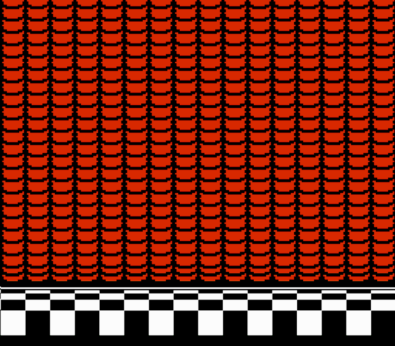
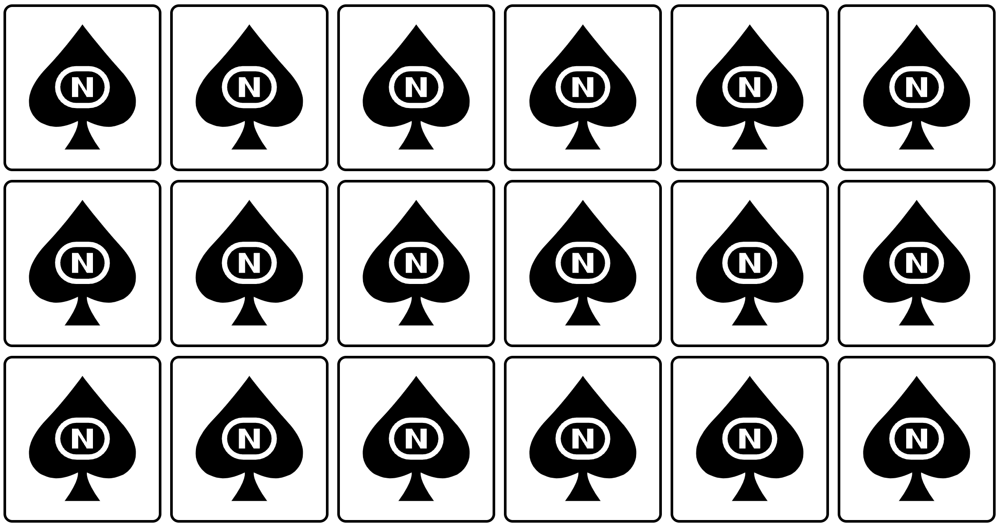
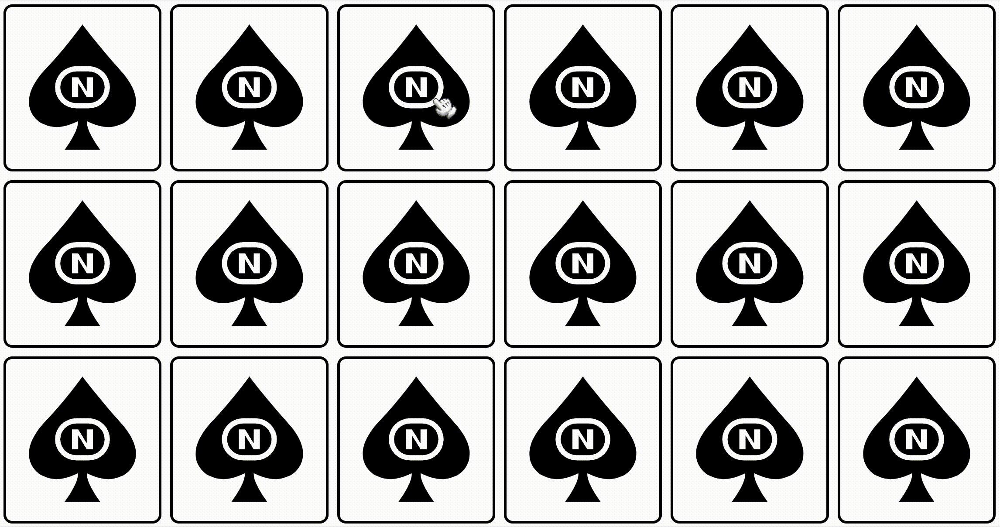

# 💃 AdaLoversConf22
👋 Hola!! Las **slides** del Workshop las tenéis [aquí](./memory-game/assets/slides/slides.pdf)
### 🎁 Repositorio del Workshop "Desarrolla tu primer videojuego"

En este tutorial veremos conceptos básico de `HTML`, `CSS` y `JS`. Tocaremos `transiciones`, `data-attributes`, `flexbox`...**no hace falta ser una experta** para seguir este tutorial, si sabéis que estos lenguajes web existen, es todo lo que se necesita 🤘.

(ℹ️ Vamos a utilizar con `vanilla` tanto en `css` como en `js`. **No utilizaremos** ni precompiladores como `SASS`, ni frameworks como `Tailwind`,ni `TypeScript`.)



### 🏗 Arquitectura de archivos

Estos son los **archivos necesarios** para nuestro proyecto:

1. Creamos la carpeta de `memory-game`
2. Entramos en la carpeta creada
3. Dentro generamos los archivos `index.html` `styles.css` `scripts.js`
4. Creamos la carpeta `assets` 

##### Cómo crear los archivos directamente en la consola:
- 1️⃣  mkdir memory-game
- 2️⃣  cd memory-game
- 3️⃣  touch index.html styles.css scripts.js
- 4️⃣  mkdir assets

### 🍱 Cositas en nuestro HTML
En el archivo `index.html` tenemos que linkar los dos archivos que hemos creado, el `styles.css` y el `scripts.js`.

```
<!-- index.html -->

<!DOCTYPE html>
<html lang="es">
  <head>
      <meta charset="UTF-8">
      <title>Super Mario Bros 3 - Juego de memoria</title>
      <link rel="stylesheet" href="./styles.css">
  </head>
  <body>
      <script src="./scripts.js"></script>
  </body>
</html>
```

### ⛩ Layout principal
Creamos el layout principal con un tag `section` en la estructura del `html`.

```
<!-- index.html -->

<body>
  <section class="memory-game"></section>
</body>
```

### 🧩 Assets para nuestro jueguico
La **interfaz del juego** se ha diseñado en `Figma`. Cada `item` es un componente con `variants` 👇


- En la carpeta assets en formato `.png` y `.svg`
- `SVGOMG` para optimizar los `.svg`
- `ImageOptim` para optimizar las imágenes

- Los assets originales los podéis encontrar en mi **perfil de Community de Figma**

### 🃏 Nuestro jueguico de cartas
El juego consta de **18 cartas**, cada una está creada por un `div` contenedor que hemos llamado `.memory-card`, el cuál tiene **dos imágenes** `SVG`. 
La primera imágen será la cara frontal `front-card` y **la segunda será común** a todas, con el logo original de **Nintendo** cómo `back-card`.


```
<!-- styles.css -->

<div class="memory-card">
  
  
</div>
```

### 💣 CSS al ataque
Utilizaremos un **reset** muy básico pero **efectivo** 👇

```
<!-- styles.css -->

/* reset */

* {
  padding: 0;
  margin: 0;
  box-sizing: border-box;
}
```

ℹ️ **Un poco de teoría**:

- El modelo de caja `box-sizing`: La propiedad `border-box` incluye los padding y valores de borders **dentro del tamaño total del elemento**, width y height. 🧮 Así **simplificamos los cálculos**.

- Indicando `display: flex;` a la clase `.memory-game` que actua cómo contenedor, creamos una alineación vertical y horizontal.

- La clase `.memory-game` también será un contenedor con comportamiento `flex-container`. Por defecto, los elementos vienen seteados con `shrink` en lo ancho para ajustarse al contenedor. Seteando `flex-wrap` con el valor `wrap`, los `flex-items` se posicionará  a lo largo de multiples lineas dependiendo de su propio tamaño.

```
<!-- styles.css -->

.memory-game {
  width: 100vw;
  height: 100vh;
  display: flex;
  flex-flow: row wrap;
  place-content: space-around;
  justify-content: center;
}
```
### 🍍 Dando estilo a nuestro jueguico
La altura y el ancho de cada carta está calculado con la función `calc()` de `CSS`, hemos creado `3 filas`, con **6 cartas en cada fila** con un `16.6%` y una altura de `33.3%` y **restamos 10px** para añadir el margen entre cartas.

Para poder posicionar los **hijos** del contenedor `.memory-card`, hemos añadido la propiedad `position: relative`, para poder posicionarlos de manera absoluta `position: absolute` y sean relativos al contenedor **madre**. 👇

**❓ ¿Se entiende este comportamiento?**

La propiedad `position: absolute` está indicada a ambas caras de las cartas `.front-card` y `.back-card` esto hará que los elementos salgan de su flujo normal y se posicionen una cara sobre otra.

```
<!-- styles.css -->

.memory-card {
  width: calc(16.666% - 10px);
  height: calc(33.333% - 10px);
  margin: 5px;
  position: relative;
}

.front-card,
.back-card {
  width: 100%;
  height: 100%;
  padding: 20px;
  position: absolute;
  border-radius: 10px;
  border: 3px solid var(--border);
}
```


### 🍿 Animando el cotarro
Vamos a añadir una micro interacción que simulará un `efecto click`. La **pseudo clase** `:active` actuará de **trigger** cada vez que el elemento sea clicado y aplicará una animación al tamaño de la carta con `.2s transition`. 
A la clase `.memory-card` le añadimos un `transform: scale(1)`.

```
<!-- styles.css -->

.memory-card {
  width: calc(16.666% - 10px);
  height: calc(33.333% - 10px);
  margin: 5px;
  position: relative;
  transform: scale(1);
}

 .memory-card:active {
   transform: scale(0.97);
   transition: transform .2s;
 }
 ```

### 👋 Añadir cursor custom
Hemos añadido la **manita de Mario** como cursor para simular que es él quién está seleccionando las cartas.

Podemos **crear un cursor custom** con la siguiente linea de código👇

```
<!-- styles.css -->

body {
  cursor: url('./assets/cursor.cur'), auto;
}
```
### 🩴 Flip card
Para crear el efecto de voltear la carta cada vez que sea clicada, vamos a añadir la clase `.flip`. 
- Con un `document.querySelectorAll` seleccionamos todos los elementos del contenedor `memory-card` y se genera un loop con cada `forEach` y le atacha un `event listener`. 

- **Cada vez que una carta sea** clicada la `función flipCard` será ejecutada.
La variable `this` representa que la carta ha sido clicada. 

La función `flipCard()` accede a los elementos de `classList` y hace un `toggles` a la `flip class`:

```
<!-- scripts.js -->

const cards = document.querySelectorAll('.memory-card');

function flipCard() {
  this.classList.toggle('flip');
}

cards.forEach(card => card.addEventListener('click', flipCard));
```

La clase `.flip` rota la carta `180deg`:

```
.memory-card.flip {
  transform: rotateY(180deg);
}
```

Para producir el `efecto 3D`, añadimos una propiedad de perspectiva a la clase `.memory-game`. Esta propiedad define cuanto de lejos en el plano de `a` el objeto se alejará de nuestra vista.


Para un efecto **subtle** aplicamos a la perspectiva un valor de `1000px` añadiendo a la clase `.memory-game` la propiedad `perspective: 1000px;`:

```
<!-- styles.css -->

.memory-game {
   width: 100vw;
  height: 100vh;
  display: flex;
  flex-flow: row wrap;
  place-content: space-around;
  justify-content: center;
  perspective: 1000px;
}
```
A los elementos `.memory-card` le añadimos un `transform-style: preserve-3d`, para posicionarlos en el espacio en 3D que hemos creado en su madre, **en lugar de aplanarlos en el plano `z = 0`** (`transform-style`).

Añadiendo la propiedad `transform-style: preserve-3d;`

```
<!-- styles.css -->

.memory-card {
  width: calc(16.666% - 10px);
  height: calc(33.333% - 10px);
  margin: 5px;
  position: relative;
  transform: scale(1);
  transform-style: preserve-3d;
}
```
**Aplicamos una transición** con la propiedad `transition: transform .5s;` para producir el efecto de movimiento:

```
<!-- styles.css -->

.memory-card {
  width: calc(16.666% - 10px);
  height: calc(33.333% - 10px);
  margin: 5px;
  position: relative;
  transform: scale(1);
  transform-style: preserve-3d;
  transition: transform .5s;
}
```
### 🌍 3D flip
¡¡Ya tenemos la carta preparada para un volteo en 3D!!

Tengo una pregunta...
**¿os aparece la cara de la carta?**

En este momento, las dos caras `.back-card` y `.front-card` están posicionadas encima con un **posicionamiento absoluto**. 
Cada elemento tiene una cara trasera, que es una imagen espejo de su cara delantera.
La propiedad `backface-visibility` **por defecto es visible**, así que cuando la carta gira, lo que obtenemos es la cara con item de `.back-card`

Para **revelar la imagen oculta** que hay debajo, aplicamos un `backface-visibility: hidden;` a las clases `.front-card` y `.back-card`.

```
<!-- styles.css -->

.front-face,
.back-face {
  width: 100%;
  height: 100%;
  padding: 20px;
  position: absolute;
  border-radius: 10px;
  border: 3px solid var(--border);
  backface-visibility: hidden;
}
```

Como hemos ocultado ambas imágenes, la cara y la cruz, no hay nada en el otro lado. Así que ahora tenemos que girar la `.front-card` con `180` grados gracias a la propiedad `transform: rotateY(180deg);`:

```
<!-- styles.css -->

.front-face {
  transform: rotateY(180deg);
}
```

Ya tenemos controlado el giro! 🥳



### 🧡 Encontrando su media naranja
El comportamiento/funcionalidad que queremos es:

- **Cuando hacemos clic en la primera carta**, debe esperar hasta que se gire la siguiente. 
- Las variables `hasFlippedCard` y `flippedCard` administrarán el `estado` de `flip`. 
- **En caso de que no haya una carta girada**, `hasflippedCard` está configurada en `True` y `flippedCard` está configurada a la tarjeta que ha tenido el clic.

También cambiamos el método `toggle` para agregar:

```
<!-- scripts.js -->

  const cards = document.querySelectorAll('.memory-card');

+ let hasFlippedCard = false;
+ let firstCard, secondCard;

  function flipCard() {
-   this.classList.toggle('flip');
+   this.classList.add('flip');

+   if (!hasFlippedCard) {
+     hasFlippedCard = true;
+     firstCard = this;
+   }
  }

cards.forEach(card => card.addEventListener('click', flipCard));
```

Entonces, cuando el usuario hace clic en la segunda carta, entramos en el bloque `else` de nuestra `condition`. Así que necesitamos comprobar si hay un `match` para poder hacer esto, tenemos que identificar cada una de las cartas.

Cuando necesitemos añadir información extra a los elementos de nuestro `HTML`, podemos utilizar los atributos de datos `data attributes`. 
Lo haremos utilizando la siguiente sintaxis: 
Data- *, donde, * puede ser cualquier palabra, ese atributo se insertará en la propiedad del conjunto de datos del elemento. 
Ahora, vamos a añadir un `data-item` a cada carta:

```
<!-- index.html -->

+ <div class="memory-card" data-item="star">
```

Ya podemos verificar una coincidencia accediendo a ambos conjuntos de datos de tarjetas. 
Podemos extraer la lógica coincidente a su propio método `checkForMatch()` y también establecer de nuevo a `false` el `hasFlippedCard`. 
En el caso de una coincidencia, se invoca a `disableCards()` y los `listeners` del evento en ambas tarjetas se separan, para evitar más giros. 
De lo contrario, `unflipCards()` devolverá ambas tarjetas con un tiempo de espera de `1500ms` (`timeout`) que elimina la clase `.flip`:

### ⚡️ Fusiiiiiiiiión-ando todo:

```
<!-- scripts.js -->

const cards = document.querySelectorAll('.memory-card');

  let hasFlippedCard = false;
  let firstCard, secondCard;

  function flipCard() {
    this.classList.add('flip');

    if (!hasFlippedCard) {
      hasFlippedCard = true;
      firstCard = this;
+     return;
+   }
+
+   secondCard = this;
+   hasFlippedCard = false;
+
+   checkForMatch();
+ }
+
+ function checkForMatch() {
+   if (firstCard.dataset.framework === secondCard.dataset.framework) {
+     disableCards();
+     return;
+   }
+
+   unflipCards();
+ }
+
+ function disableCards() {
+   firstCard.removeEventListener('click', flipCard);
+   secondCard.removeEventListener('click', flipCard);
+ }
+
+ function unflipCards() {
+   setTimeout(() => {
+     firstCard.classList.remove('flip');
+     secondCard.classList.remove('flip');
+   }, 1500);
+ }

  cards.forEach(card => card.addEventListener('click', flipCard));

```
### 🎩 Con un ternarío
Una forma más elegante de escribir la condición de `match` es usar un operador ternario.

Está compuesto por tres bloques:
1️⃣ El primer bloque es la condición a evaluar. 
2️⃣ El segundo bloque se ejecuta si la condición devuelve verdadera. 
3️⃣ De lo contrario el bloque ejecutado es el tercero:

```
<!-- scripts.js -->

- if (firstCard.dataset.name === secondCard.dataset.name) {
-   disableCards();
-   return;
- }
-
- unflipCards();

+ let isMatch = firstCard.dataset.name === secondCard.dataset.name;
+ isMatch ? disableCards() : unflipCards();
```
## 💎 Corner cases
### 🧱 Bloquear el tablero
Ahora ya tenemos la logica de emparejamiento, vamos a bloquear el tablero para evitar que dos juegos de cartas se giren al mismo tiempo, de lo contrario nuestro giro fallaría.

```
<!-- scripts.js -->

const cards = document.querySelectorAll('.memory-card');

  let hasFlippedCard = false;
+ let lockBoard = false;
  let firstCard, secondCard;

  function flipCard() {
+   if (lockBoard) return;
    this.classList.add('flip');

    if (!hasFlippedCard) {
      hasFlippedCard = true;
      firstCard = this;
      return;
    }

    secondCard = this;
    hasFlippedCard = false;

    checkForMatch();
  }

  function checkForMatch() {
    let isMatch = firstCard.dataset.name === secondCard.dataset.name;
    isMatch ? disableCards() : unflipCards();
  }

  function disableCards() {
    firstCard.removeEventListener('click', flipCard);
    secondCard.removeEventListener('click', flipCard);
  }

  function unflipCards() {
+     lockBoard = true;

    setTimeout(() => {
      firstCard.classList.remove('flip');
      secondCard.classList.remove('flip');

+     lockBoard = false;
    }, 1500);
  }

  cards.forEach(card => card.addEventListener('click', flipCard));
```

### 🖱 Clicar dos veces en la misma carta
Ya sabemos que cómo usuarias, somos expertas en liarla. Y sigue habiendo la posibilidad de clicar dos veces en la misma carta. 
La condición de correspondencia se evaluaría como `true`, eliminando el `listener` del evento de esa carta. 
Para evitar este comporatemiento, vamos a verificar si la carta actualizada actual es igual a la `firstCard` y que regrese si es positiva.

```
<!-- scripts.js -->

if (this === firstCard) return;
```

Las variables de `firstCard` y `secondCard` variables necesitan ser reseteadas después de cada ronda de juego, así que vamos a extraer esta lógica a un nuevo método `resetBoard()`. 
Seteamos las `hasFlippedCard = false;` y `lockBoard = false`. 
La *es6 destructuring assignment* `[var1, var2] = ['value1', 'value2']`, nos permite a mantener nuestro código super simple:

ℹ️ (Con **es6** nos referimos al estándar que ya va por la versión ES6 y determina cómo emplear el lenguaje Javascript)

ℹ️ (Destructuring assignment es una sintaxis especial de ECMAScript 6 que nos permite **desempaquetar** `arrays` o `objects` en un montón de variables)
```
<!-- scripts.js -->

function resetBoard() {
  [hasFlippedCard, lockBoard] = [false, false];
  [firstCard, secondCard] = [null, null];
}
```

El nuevo método será llamado por ambas `disableCards()` y `unflipCards()`:

```
<!-- scripts.js -->

const cards = document.querySelectorAll('.memory-card');

  let hasFlippedCard = false;
  let lockBoard = false;
  let firstCard, secondCard;

  function flipCard() {
    if (lockBoard) return;
+   if (this === firstCard) return;

    this.classList.add('flip');

    if (!hasFlippedCard) {
      hasFlippedCard = true;
      firstCard = this;
      return;
    }

    secondCard = this;
-   hasFlippedCard = false;

    checkForMatch();
  }

  function checkForMatch() {
    let isMatch = firstCard.dataset.name === secondCard.dataset.name;
    isMatch ? disableCards() : unflipCards();
  }

  function disableCards() {
    firstCard.removeEventListener('click', flipCard);
    secondCard.removeEventListener('click', flipCard);

+   resetBoard();
  }

  function unflipCards() {
    lockBoard = true;

    setTimeout(() => {
      firstCard.classList.remove('flip');
      secondCard.classList.remove('flip');

-     lockBoard = false;
+     resetBoard();
    }, 1500);
  }

+ function resetBoard() {
+   [hasFlippedCard, lockBoard] = [false, false];
+   [firstCard, secondCard] = [null, null];
+ }

  cards.forEach(card => card.addEventListener('click', flipCard));
```
### 🃏 A barajar
Nuestro juego se ve bastante bien, pero no hay diversión si las cartas no se barajan, así que vamos a revisar esta parte.

Cuándo `display: flex` está declarado en el contenedor, los `flex-item` están organizados por la siguiente jerarquía: 
- Grupo
- Orden de origen

Cada grupo está definido por la propiedad orden, que posee un número positivo entero o negativo.

De manera predeterminada, cada `flex-item` tiene su propiedad de orden establecida en 0, lo que significa que todas las cartas de la barajan pertenecen al mismo grupo y se presentarán por orden de origen.

Si hay más de un grupo, los elementos se organizan en primer lugar mediante el orden grupal ascendente.

Hay **16 cartas** en este juego, vamos a iterar entre ellas, **generando un número random** entre 0 y 16 y asignandolo a la propiedad de orden del `flex-item`:

```
<!-- scripts.js -->

function shuffle() {
  cards.forEach(card => {
    let ramdomPos = Math.floor(Math.random() * 16);
    card.style.order = ramdomPos;
  });
}
```
Para invocar la `función shuffle`, hagamos que sea una expresión de la función invocada inmediatamente `(Immediately Invoked Function Expression - IIFE)`, lo que significa que se ejecutará justo después de su declaración. 

Los scripts deberían verse así:

```
<!-- scripts.js -->

const cards = document.querySelectorAll('.memory-card');

  let hasFlippedCard = false;
  let lockBoard = false;
  let firstCard, secondCard;

  function flipCard() {
    if (lockBoard) return;
    if (this === firstCard) return;

    this.classList.add('flip');

    if (!hasFlippedCard) {
      hasFlippedCard = true;
      firstCard = this;
      return;
    }

    secondCard = this;
    lockBoard = true;

    checkForMatch();
  }

  function checkForMatch() {
    let isMatch = firstCard.dataset.name === secondCard.dataset.name;
    isMatch ? disableCards() : unflipCards();
  }

  function disableCards() {
    firstCard.removeEventListener('click', flipCard);
    secondCard.removeEventListener('click', flipCard);

    resetBoard();
  }

  function unflipCards() {
    setTimeout(() => {
      firstCard.classList.remove('flip');
      secondCard.classList.remove('flip');

      resetBoard();
    }, 1500);
  }

  function resetBoard() {
    [hasFlippedCard, lockBoard] = [false, false];
    [firstCard, secondCard] = [null, null];
  }

+ (function shuffle() {
+   cards.forEach(card => {
+     let ramdomPos = Math.floor(Math.random() * 16);
+     card.style.order = ramdomPos;
+   });
+ })();

  cards.forEach(card => card.addEventListener('click', flipCard));
```
### 🙌 YA LO TENEMOS

### 🏴‍☠️ Enlace del jueguico en codepen
- Proyecto en [codepen](https://codepen.io/carmenansio/pen/OJZMBwq/c9a3da5deb777c337616360afb27e8a2)
### 👾 Gente que hace Jueguitos Web
- Jamie-Coulter en [codepen](https://trost.notion.site/trost/Jamie-Coulter-s-CodePen-Gameshttps-codepen-io-jcoulterdesign-full-NeOQzX-1827d229ceea47cea1255c195c95d78d)
- Alvaro Montoro [CSSimon](https://codepen.io/alvaromontoro/pen/BaxKqwO)
